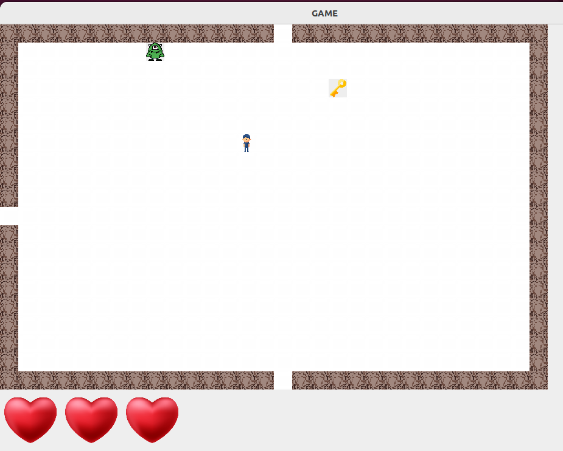

# Jeu d'aventure
Bienvenue dans `ZELDO` ! Préparez-vous à plonger dans un monde rempli de défis, de trésors et de rencontres
étranges. Il s'agit d'un jeu d'aventure qui se deroule dans un monde fantastique avec des pieces, des clés, des monstres, des tresors, etc...

## Démarrage rapide
Dans un terminal ouvert dans le dossier du projet, exécuter les commandes suivantes :

- Compilation : `javac -d bin/ -cp src/ src/main/Main.java`

- Exécution : `java -cp bin main.Main`

## Manuel d'utilisation
Pour de plus amples details, veillez consulter le manuel d'utilisation de ce jeu qui se trouve dans le fichier `rapport.pdf`